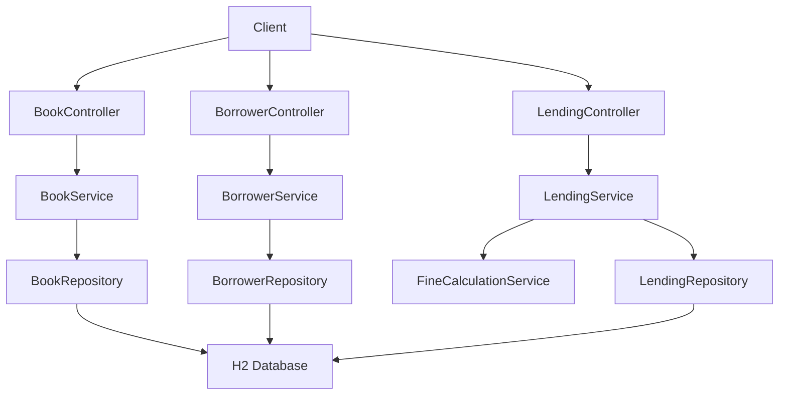
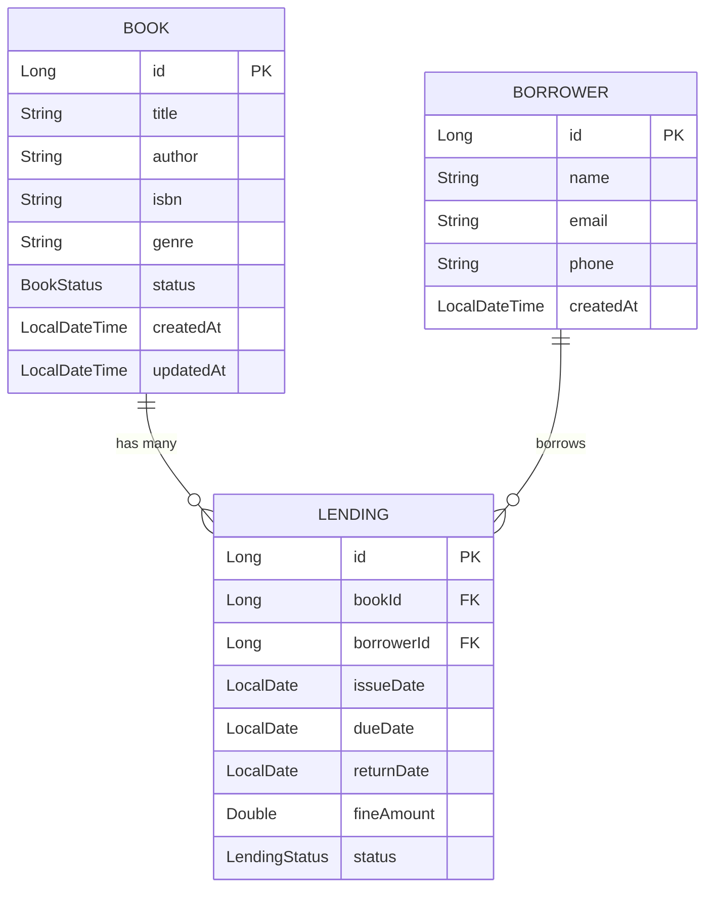
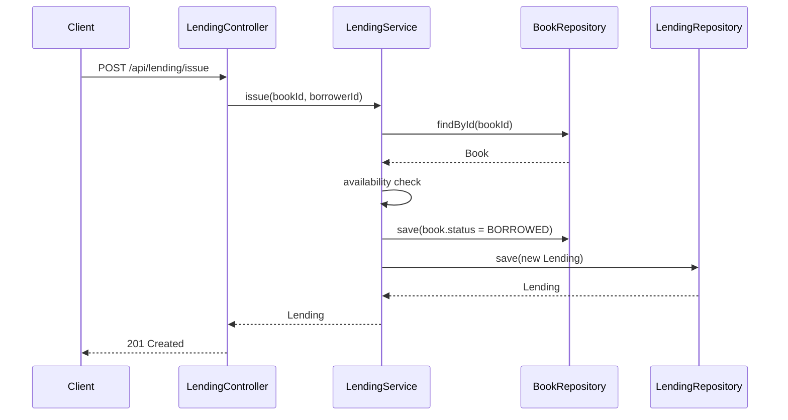

# Library Management - Architecture

## 1. High Level Architecture

## 2. Entity Relationship Diagram

## 3. API Specification

See [docs/api-spec.md](docs/api-spec.md).

## 4. Low Level Design

### BookService
- Responsibility: CRUD + search for books.
- Key methods: `create(BookCreateRequest) | update(Long, BookUpdateRequest) | get(Long) | list(Pageable) | delete(Long)`
- Exceptions: `BookNotFoundException`, `ValidationException`
- Transactions: all mutating methods `@Transactional`

### BorrowerService
- Responsibility: borrower lifecycle, validation.
m Key methods: `create(BorrowerCreateRequest) | update(Long, BorrowerUpdateRequest) | get(Long) | list(Pageable) | delete(Long)`
- Exceptions: `BorrowerNotFoundException`, `ValidationException`
- Transactions: all mutating methods `@Transactional`

### LendingService
- Responsibility: issue/return/renew flows, integrates fine calculation.
 - Key methods: `issue(Long, Long) | returnBook(Long) | renew(Long) | get(Long) | list(...) | payFine(Long, PaymentRequest)`
- Exceptions: `BookNotAvailableException`, `BorrowingLimitExceededException`, `LendingNotFoundException`
- Transactions: `issue`,`returnBook`, `renew`, `payFine` are `@Transactional`

### FineCalculationService
- Responsibility: compute overdue fines (LIB-13). 
- Key methods: `calculateFine(LocalDate dueDate, LocalDate returnDate): BigDecimal`
- Exceptions: none (pure function)
- Transactions: none

## 5. Sequence Diagram — Issue a Book

## 6. Tech Stack

| Component | Technology | Version | Purpose |
|---|---|---:|---|
| Language | Java | 17 | Core runtime |
|Framework | Spring Boot | 3.2.0 | REST + DI |
| DB (dev) | H2 | 2.x | Local/in-memory DB |
| Boilerplate | Lombok | 1.18.x | Reduce boilerplate |
|Build | Gradle | 8.x | Build automation |
| Unit tests | JUnit 5 | 5.x | Testing |
|E2E | Playwright | 1.x | UI.API testing |
| API docs | SpringDoc OpenAPI | 2.x | Swagger/OpenAPI |
